# How Are Your Reactions
The purpose of How Are Your Reactions is to provide some tools for anyone interested in testing and or enhancing their reaction times. It can also serve as a minigame competition for a user and their friends to see who can score the best score, or even beat the highscore in our grid clicking game. 

Upon opening the site the user will be met with a fairly minimalistic design to allow the user to more easily gauge what functions the page has to offer.

Website live link: [How are your reactions](https://felteng.github.io/how-are-your-reactions/)

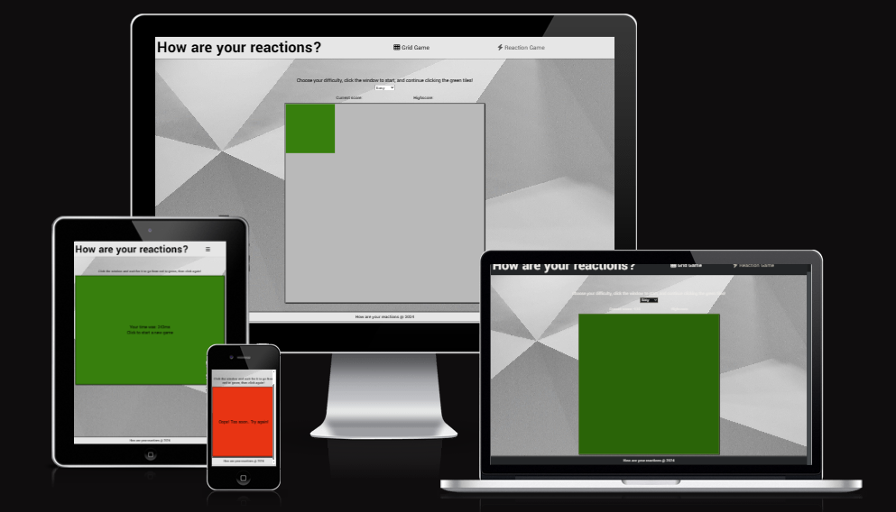

## User stories
- Index / Grid Game
    - As a visitng user, I would like to put my continous reactions to the test and see how I compare to the highscore.

- Reaction Game
    - As a visiting user, I would like to test my raw, single input, reaction time.

## Features

### Welcome to How Are Your Reactions. 
- Additionally you can test and hone your skills when it comes to continous reactions with our **Grid Game**.
    - Features the same start procedure as the Reaction Game but here you will click multiple small green tiles as they appear.

    - Keep track of your score and your highscore.

    - Modify the difficulty yourself to increase the score you gain. But also decrease your window of reaction where you lost points if you fail to click in time!

- Test your reaction time with our **Reaction Game**.  

    - Simply wait and react as the big window turns green. And see how you did.

### Wireframes and initial js function planning

- Wireframes \
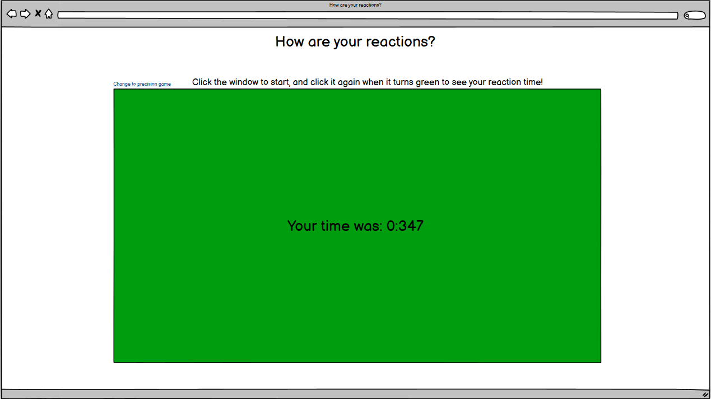 \
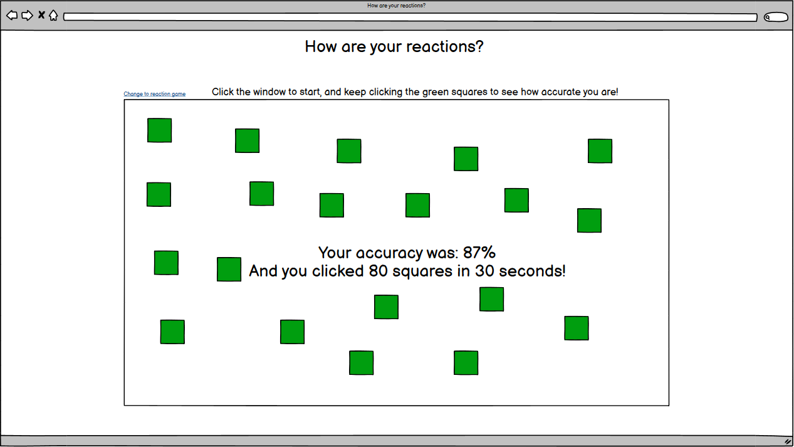

- Base functions
    - gameStartTimer()

    - startGame()

    - reactionGame()

    - speedTimer()

    - gridGame()

    - accuracyTracker()

### Features and look after development
- **Color, contrast, and background**
    - The site features a fairly minimalistic combination of light grey, white, and black text to make it easy on the eyes for the user.

    - It also allows for the green and the red colors within the games to provide a higher grade of clarity as to what is happening.

- **Navigation bar**
    - The navigation bar is featured at the top of the page as any visiting user would expect. \
    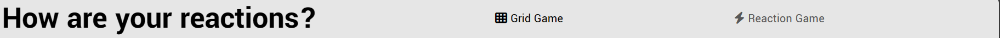
    - It allows for quick navigation between the 2 game pages, and any potential future pages.

    - If a user is visitng the site from a smaller device the navigation bar is togglable through a conventional "burger menu" icon. \
    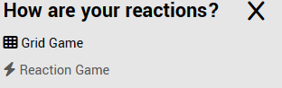

- **Landing page and Grid Game**
    - The homepage of the site features the first of the 2 currently available games, the *Grid Game*.

    - The user should quickly be able to spot the difficulty selection menu, as well as the current highscore held for the Grid Game.

    - This should lead to encouragement for the user to give the game a try and see how they can compare. \
    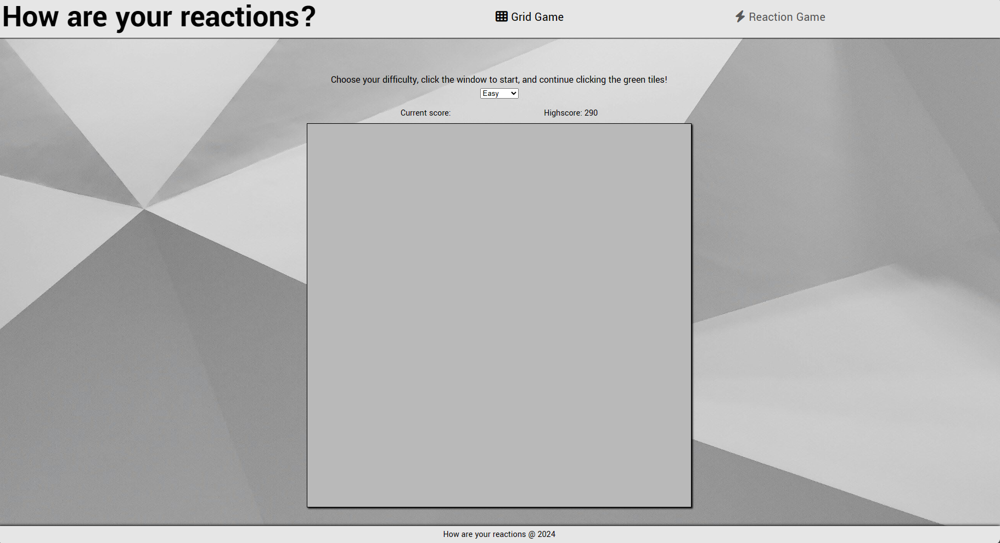

    - When the Grid Game is started there will be a tile in the window highlighted in green to let the user know it should be clicked. \
    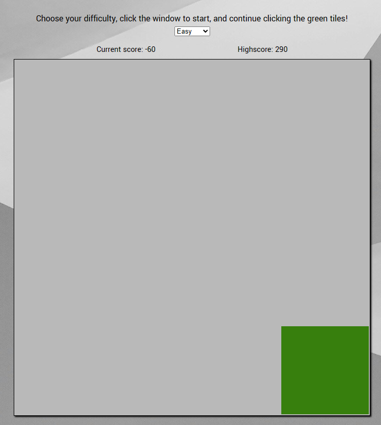

    - When the game ends the whole window will turn green and after 2 seconds the user may restart the game if they wish. \
    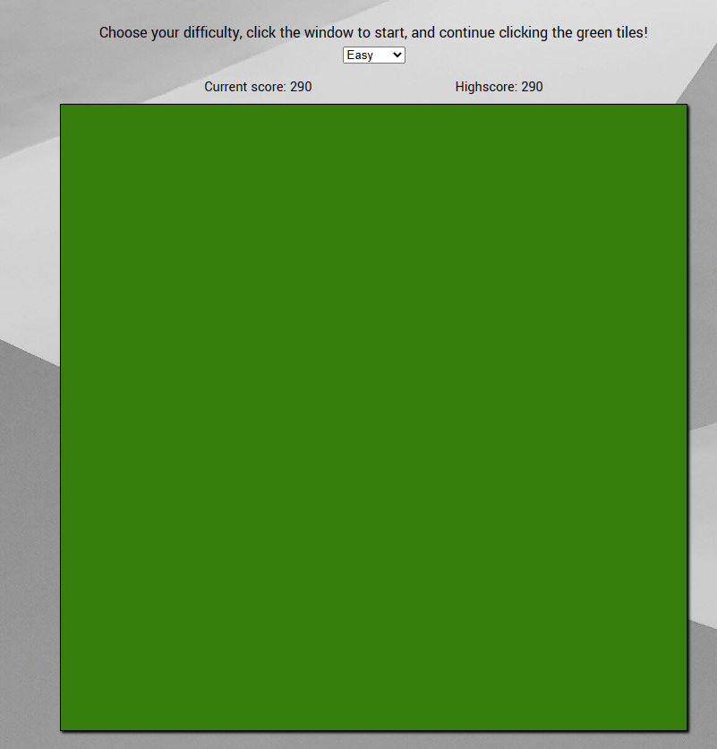

- **Reaction Game** 
    - As the user lands on the reaction game page it should feel even more straightforward than the first page.

    - The user will be met with a similar looking window to press, with the neccessary information above. \
    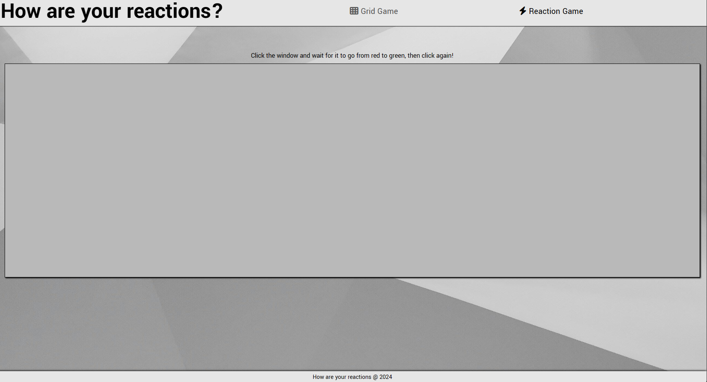

    - When the user completes the reaction game there will be prompt in the middle of the game area informing the user how they reacted. \
    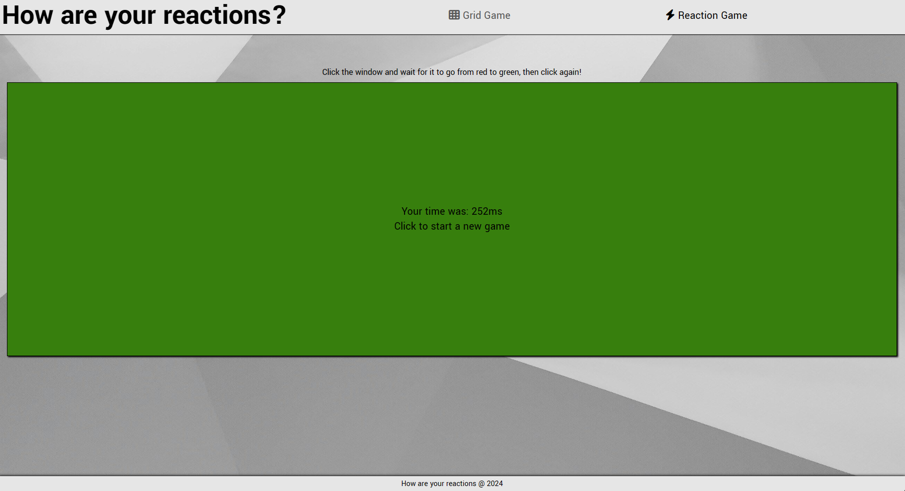

- **The Footer**
    - The footer hold no specific information other than a watermark and the year the page was created.

The project ended up with more functions than the initial planning, which is of no worry. Some of the functions from the planning ended up not being used or implemented due to a change of plans during the development.

### Future features
- Acquire more knowledge as to how we would go about implementing a 1ms accurate timer for the reaction game.

- Add more customization options to the Grid Game to allow the user to tailor their experience more.

## Technologies

- HTML
    - HTML was used to create the structural elements of the website.

- CSS 
    - CSS has been used to apply style and adjusting the layout of the HTML structure.

- JavaScript
    - JavaScript has been the tool used to create the functionality of the website. Everything from how the games function to being able to toggle the navbar on smaller devices.

- Google Fonts
    - Google Fonts was used to import the Yantramanav font featured throughout the webiste.

- Font Awesome
    - Font Awesome has seen use through importing icons to the page. Namely the Grid Game and Reaction Game icons in the navbar.

- Favicon.io
    - Favicon.io was used to obtain the websites favicon.

## Testing

### Test Cases
- Index / Grid Game

    - Open the index page of the website.
        - Expected output: See the page header with links to both games with *Grid Game* highlighted in black, the name of the page in the header, the grid game istself in the middle of the page with the Highscore displayed above the game window, and the footer at the bottom.
        - Actual output: Page header with links to both games with *Grid Game* highlighted in black, the name of the page in the header, the grid game istself in the middle of the page with the Highscore displayed above the game window, and the footer at the bottom all visible upon opening the page.

    - Click the page name heading in the header.
        - Expected output: Have the index page refreshed as it get directed to again.
        - Actual output: Index page refreshed.

    - Click the *Grid Game* button in the header navbar.
        - Expected output: Have the index page refreshed as it get directed to again.
        - Actual output: Index page refreshed.

    - Click the *Reaction Game* button in the header navbar.
        - Expected output: Get directed to the Reaction Game page.
        - Actual output: Directed to the Reaction Game page.

    - Click the difficulty selection selection.
        - Expected output: See a dropdown of difficulties in order, Easy, Medium, and Hard.
        - Actual output: A dropdown of difficulties in order, Easy, Medium, and Hard displayed.

    - Click the game window in middle of the page with the difficulty set to *Easy* as per the instructions above it and do nothing.
        - Expected output: Window should turn red for 1 up to 5 seconds until it goes back to the same grey color but with a green tile showing and moving inside it with even an interval, current score should go down by -10 every time the tile moves. After 15 seconds it should stop and the window should go fully green to indicate the game is over.
        - Actual output: Window turned red for 1 up to 5 seconds until it went back to the same grey color but with a green tile showing and moving inside it with an even interval, current score going down by -10 every time the tile moves. After 15 seconds the game stopped and the window turned fully green.

    - Click the green window to start the game again on *Easy* but this time click the tiles.
        - Expected output: Current score should go up by 10 every time the tile is clicked, every time the tile is clicked it should also move to a new location, sometimes it might appear in the same location again. If the attempt to click the tile at any point fails before the interval runs out for it to appear again currenct score should go down by -10. 
        - Actual output: Current score goes up by 10 every time the tile is clicked, every time the tile is clicked it also moves to a new location, sometimes it appears in the same location again. Whenever the attempt to click failed current score went down by -10.

    - Change the game difficulty to *Medium*, click the window, and do nothing.
        - Expected output: Window should turn red for 1 up to 5 seconds until it goes back to the same grey color but with a green tile showing and moving inside it with even, faster interval than on *Easy*, current score should go down by -10 every time the tile moves. After 15 seconds it should stop and the window should go fully green to indicate the game is over.
        - Actual output: Window turned red for 1 up to 5 seconds until it went back to the same grey color but with a green tile showing and moving inside it with an even, faster interval than on *Easy*, current score going down by -10 every time the tile moves. After 15 seconds the game stopped and the window turned fully green.

    - Click the green window to start the game again on *Medium* but this time click the tiles.
        - Expected output: Current score should go up by 15 every time the tile is clicked, every time the tile is clicked it should also move to a new location, sometimes it might appear in the same location again. If the attempt to click the tile at any point fails before the interval runs out for it to appear again currenct score should go down by -10.
        - Actual output: Current score goes up by 15 every time the tile is clicked, every time the tile is clicked it also moves to a new location, sometimes it appears in the same location again. Whenever the attempt to click failed current score went down by -10.

    - Change the game difficulty to *Hard*, click the window, and do nothing.
        - Expected output: Window should turn red for 1 up to 5 seconds until it goes back to the same grey color but with a green tile showing and moving inside it with even, faster interval than on *Medium*, current score should go down by -10 every time the tile moves. After 15 seconds it should stop and the window should go fully green to indicate the game is over.
        - Actual output: Window turned red for 1 up to 5 seconds until it went back to the same grey color but with a green tile showing and moving inside it with an even, faster interval than on *Medium*, current score going down by -10 every time the tile moves. After 15 seconds the game stopped and the window turned fully green.

    - Click the green window to start the game again on *Hard* but this time click the tiles.
        - Expected output: Current score should go up by 20 every time the tile is clicked, every time the tile is clicked it should also move to a new location, sometimes it might appear in the same location again. If the attempt to click the tile at any point fails before the interval runs out for it to appear again currenct score should go down by -10.
        - Actual output: Current score goes up by 20 every time the tile is clicked, every time the tile is clicked it also moves to a new location, sometimes it appears in the same location again. Whenever the attempt to click failed current score went down by -10.

    - Spam click the window to start the game
        - Expected output: Only 1 game should be started, no stacked functions getting called.
        - Actual output: Only 1 game gets started no matter how many times the user clicks.

- Reaction Game
    - Open the Reaction Game page by clicking the button for it on the Index page.
        - Expected output: The user should see the same header but with *Reaction Game* highlighted, the same footer, a slightly different looking game window than the previous one; with a different instruction above it.
        - Actual output: The same header but with *Reaction Game* highlighted, the same footer, a slightly different looking game window than the previous one; with a different instruction above it, was displayed upon opening the page.

    - Click the page name heading in the header.
        - Expected output: Get redirected to the index page.
        - Actual output: Directed back to index page.

    - Click the *Grid Game* button in the header navbar.
        - Expected output: Get redirected to the index page.
        - Actual output: Directed back to index page.

    - Click the *Reaction Game* button in the header navbar.
        - Expected output: Have Reaction Game page refreshed as it gets directed to again.
        - Actual output: Reaction Game page refreshed.

    - Click the grey game window and do as per the instruction above it.
        - Expected output: The window should turn red for 1 up to 5 seconds before turning green when the user should click the window. After clicked the green window there should be a text that pops up notifying the user how fast they reacted to the window turning green and how to start the game again.
        - Actual output: The window turned red for 1 up to 5 seconds before turning green. After clicking the green window there was a text that popped up notifying the user how fast they reacted to the window turning green and how to restart game.

    - Start the game again but this time click the window while it's still red.
        - Expected output: The internal countdown to turn the window green should stop and the user should be notified that they clicked too soon. 
        - Actual output: The game never started and user was notified they clicked too soon and that they should try again.

    - Start the game and just wait after the window turns green. Click after waiting for a while.
        - Expected output: The timer will continue counting until window is clicked and a fairly large number will be displayed after waiting.
        - Actual output: The timer continued counting until window was clicked and a fairly large number was displayed after clicking.

    - Spam click the window to start the game
        - Expected output: Only 1 game should be started, no stacked functions getting called.
        - Actual output: Only 1 game gets started no matter how many times the user clicks.

### Bugs
| Bug    | Status      | Description | Solution |
| --- | ------ | ----------- | -------- |
| Multiple games being ran at once | Resolved | If the user clicks the start box multiple times the start timer will trigger each time and end up with a lot of games being ran simultaneously | Add a boolean that prevents the start timer being called if true |
| Game timer inaccurate | Resolved | When running the game the timer is going a lot slower than the setInterval. There's a built in delay of 4ms in modern browsers | Multiply the time by 4 for better result
| Game timer can only count every 4ms | Expired | The game will only display the users times in results divisible by 4 as product of the bug fix above | *PROPOSAL*: Rewrite the function to not only rely on setInterval. Possibly a for loop inside the interval? | 
| Game timer result always divisble by 9 | ACTIVE | The result of the timer for the reaction game is always divisble by 9 thanks to the new interval of 11s with a for loop nested inside for *9* iterations. This provdided a bit better accuracy but the timer is still not 1ms precise | *PROPASAL*: Revisit the problem at a later stage and prioritize other elements of the site first |

### Validation
- HTML
    - The W3C validator found no issues within the HTML code on eihter of the pages.

- CSS
    - The W3C jigsaw validator found no issues within the CSS code.

- JavaScript
    - The JavaScript code passed through the JSHint linter without any errors. 

- Accessibilty 
    - A lighthouse analysis confirmed that the page features a good contrast and readability for the user. \
    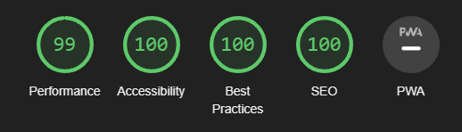

## Deployment

### Web
- The web deployment was made using GitHub Pages.

    - To deploy the project using GitHub; head to the project repository and go to settings.

    - Under Code and automation you'll want to head to "pages".

    - Once on pages you'll need to set the source to *Deploy from a branch*.

    - Under branch you'll want to set the branch to *main* and set the folder to *root*.

    - Once all of that is done give GitHub a few minutes and refresh the page. The link to the website should now be visible at the top of GitHub Pages.

### Local
- The project was deoployed locally multiple times for the purpose of live testing code.

    - To deploy locally, open a terminal in your development environment.

    - In the terminal you want to type: "python3 -m http.server" and press enter.

    - On the pop up window that appears you'll want to click Open Browser to open a new window of your project.
        - There is also the option to click Open Preview if you'd like to have the deployed project displayed within your IDE.

## Credits

### Media
- Website Favicon from [Favicon.io](https://favicon.io)

- Website background image from [Unsplash](https://unsplash.com) user Shaplined, by Naphtali Marshall.